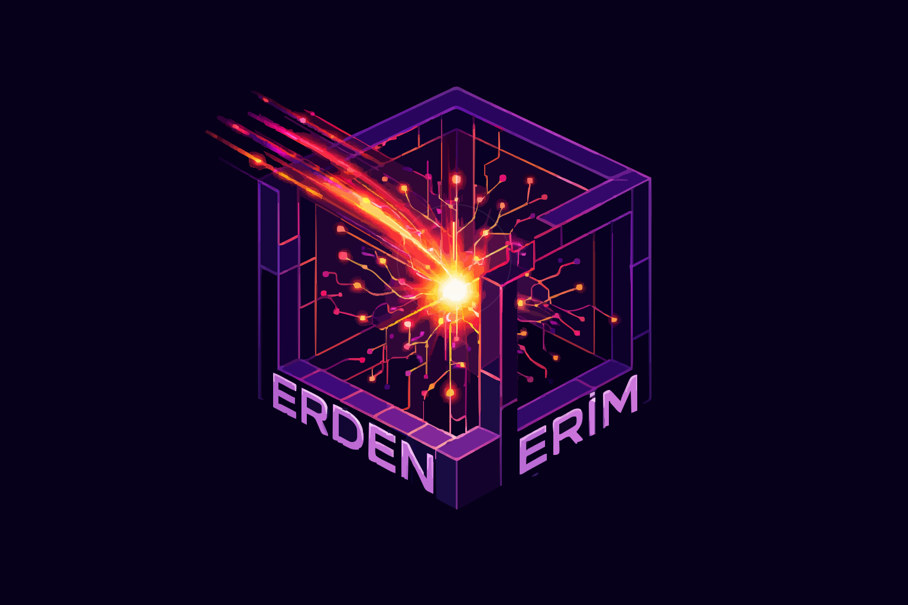

<h1 align="center">Erden Erim Aydoğdu</h1>

<b>Elektrik-Elektronik Mühendisi • Çözüm Mimarı • AI/XR/IoT</b>

Donanım, yazılım ve deneyim tasarımını aynı ürün mantığında birleştiriyorum; AI, XR, IoT ve full-stack katmanlarda çalışan sistemler kuruyorum.

  

## Kısa Profil
Yeditepe Üniversitesi Elektrik-Elektronik Mühendisliği mezunuyum. KENTAŞ deneyimi ve çok katmanlı proje pratiğiyle, sadece kod yazan değil aynı zamanda ürünün teknik yönünü, entegrasyon hattını ve anlatısını kuran bir profil olarak çalışıyorum. Bir fikri demo seviyesinden ölçülebilir bir sisteme taşımak; benim için mimari karar, kullanıcı akışı ve teknik uygulamanın aynı anda çözülmesi demek.

## Ne Yapıyorum
- AI/ML, OCR, RAG ve MCP tabanlı karar destek sistemleri geliştiriyorum.
- XR, Unreal Engine, WebXR ve Three.js ile sürükleyici deneyimler kuruyorum.
- IoT, embedded sistemler ve donanım-yazılım entegrasyonunu aynı mimaride ele alıyorum.
- Full-stack uygulamalarda veri akışı, analiz ve ürün katmanını birlikte tasarlıyorum.

## Seçili İşler
- Digital Showroom XR: Unreal Engine, C++ ve WebXR tarafını Next.js + Three.js tabanlı web katmanıyla birleştiren çok platformlu showroom ekosistemi.
- Docs AI: OCR, vektör indeksleme ve güvenli model erişimiyle raporları okunabilir, sorgulanabilir ve aksiyon üretir hale getiren analiz altyapısı.
- Sol AI: LLM ve GIS verisini bir araya getirerek mahalle bazlı talepleri stratejik kararlara dönüştüren platform.
- Gezelim App: AI destekli rota, POI seçimi ve oyunlaştırma yaklaşımıyla seyahat deneyimini sadeleştiren akıllı uygulama.
- AI Destekli MOSFET Yükselteç Tasarımı: Analog devre optimizasyonunu CNN ile otomatikleştiren, donanım ile yapay zekayı aynı hatta buluşturan çalışma.
- AI Stratejik Masa Oyunu: Q-Learning ile karar veren ajanı React arayüzüne bağlayan, öğrenen sistemlere odaklanan deneysel proje.

## Bağlantılar

  
  
  

## GitHub

  
  

